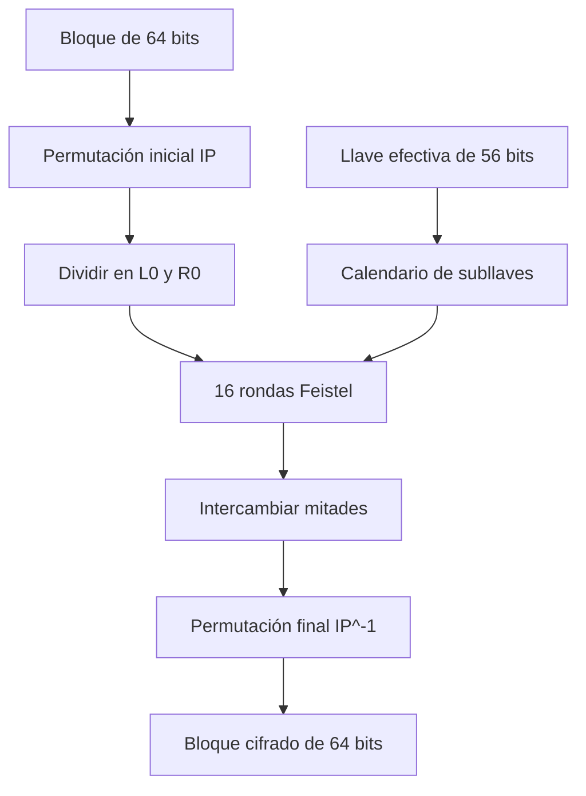
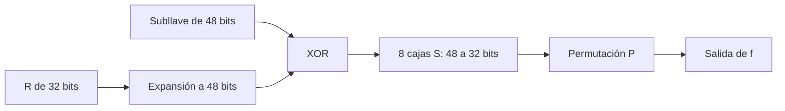
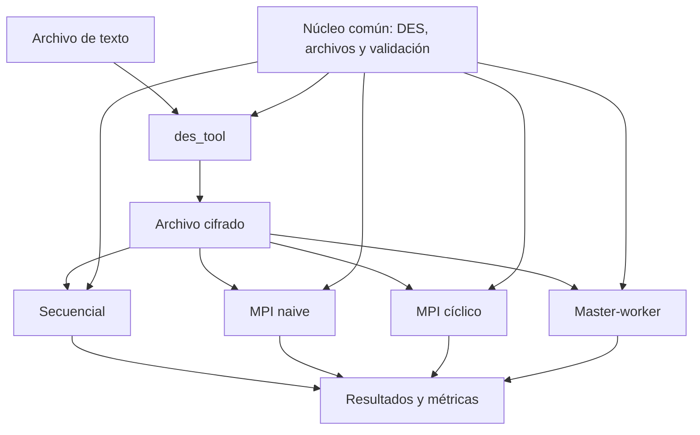
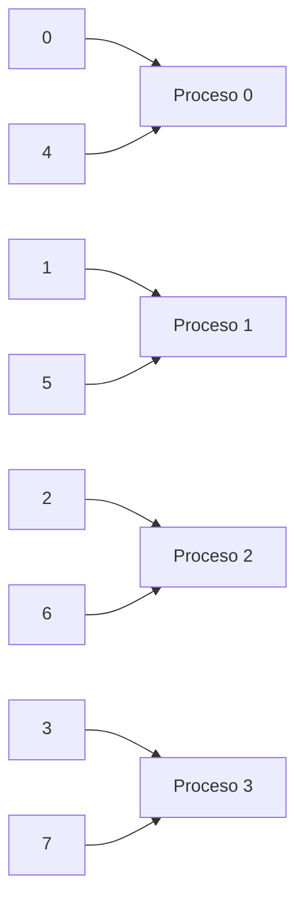
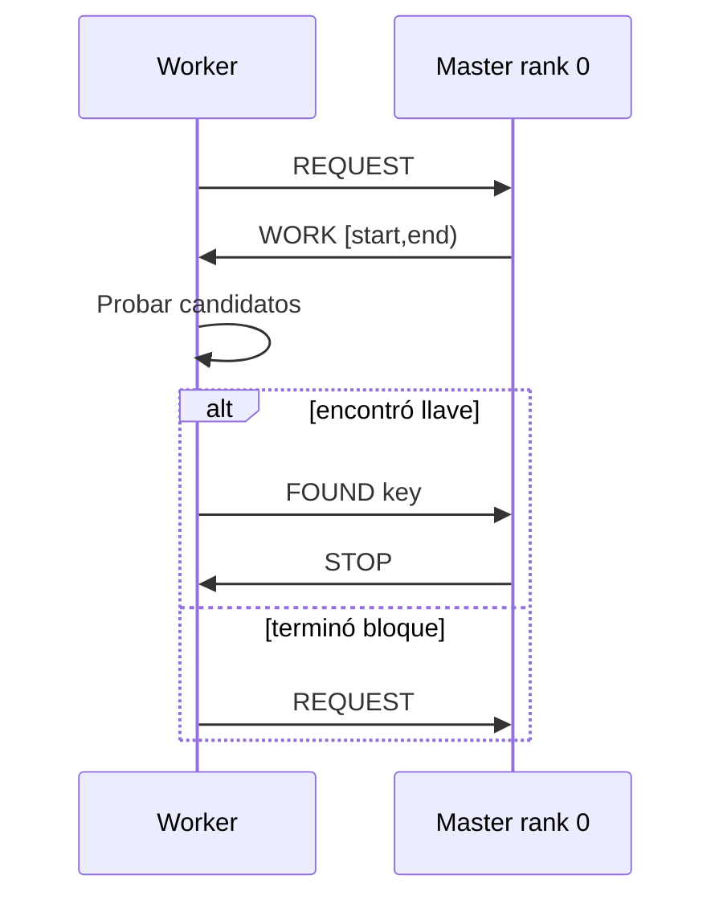

# Universidad del Valle de Guatemala

## Computación Paralela y Distribuida

### Proyecto 2: búsqueda distribuida de llaves DES mediante fuerza bruta

**Docente:** Ing. Juan Luis García  
**Integrantes:** [Nombre y carné], [Nombre y carné], [Nombre y carné]  
**Fecha:** 2 de octubre de 2026

---

## Índice

1. Resumen
2. Introducción
3. Objetivos
4. Fundamentos teóricos
5. Diseño e implementación
6. Estrategias de búsqueda
7. Metodología experimental
8. Resultados
9. Discusión
10. Conclusiones
11. Recomendaciones
12. Referencias
13. Anexo A: catálogo de funciones
14. Anexo B: primitivas MPI
15. Anexo C: reproducción y evidencia

## 1. Resumen

Este proyecto estudia la búsqueda por fuerza bruta de una llave DES de 56 bits y su paralelización mediante Open MPI. Se implementó un núcleo común en C para cifrar, descifrar, leer archivos y validar candidatos, junto con cuatro modalidades de búsqueda: secuencial, MPI naive con bloques contiguos, MPI cíclica y MPI dinámica master-worker. Las tres versiones paralelas comparten el mismo cifrado y criterio de validación, por lo que sus diferencias provienen de la distribución del espacio y de la comunicación.

La evaluación utilizó un espacio reducido de un millón de candidatos que conserva las posiciones relativas de las llaves propuestas por el enunciado. Se realizaron 105 mediciones: tres llaves, siete configuraciones y cinco repeticiones. El enfoque naive obtuvo speedups entre 0.734 y 120.907, demostrando que su rendimiento aparente depende fuertemente de la posición de la llave. La distribución cíclica fue más estable, con speedups entre 1.843 y 2.922. Master-worker obtuvo entre 0.958 y 2.487 y mostró el costo de dedicar el proceso raíz exclusivamente a coordinación. Para una carga uniforme por candidato, la distribución cíclica produjo la mejor relación entre simplicidad, estabilidad y rendimiento.

## 2. Introducción

MPI define una interfaz portable para programas que intercambian información entre espacios de memoria separados. El modelo es adecuado para máquinas de memoria distribuida, redes de estaciones de trabajo y arquitecturas híbridas. El estándar busca que los programas de paso de mensajes sean portables, eficientes y escalables [4].

El problema utilizado para estudiar este modelo consiste en recuperar una llave DES mediante fuerza bruta. Se conoce un texto cifrado y una frase que debe aparecer en el texto plano. Cada llave candidata se usa para descifrar; si el padding es válido y la frase aparece, se reporta como posible solución.

Este problema es paralelizable porque las llaves pueden probarse de forma independiente. Sin embargo, la forma de repartirlas cambia el tiempo esperado. Una partición contigua puede favorecer accidentalmente al proceso cuyo bloque empieza cerca de la llave, produciendo un speedup artificial. También puede obligar a todos los procesos a recorrer casi un bloque completo, eliminando el beneficio paralelo. Por ello, además de una línea base secuencial y una paralela naive, se implementaron distribuciones cíclica y dinámica.

DES se utiliza únicamente por requerimiento académico. FIPS 46-3 fue retirado por NIST en 2005 [1], y la guía moderna recomienda migrar hacia algoritmos y longitudes de llave más robustos [2]. No se propone esta implementación para proteger información real.

## 3. Objetivos

### 3.1 Objetivo general

Diseñar, implementar y evaluar estrategias de búsqueda distribuida de llaves DES mediante Open MPI, comparando su corrección, tiempo, speedup, eficiencia y sensibilidad a la posición de la llave.

### 3.2 Objetivos específicos

1. Implementar cifrado y descifrado DES de archivos con una llave arbitraria.
2. Construir una versión secuencial que sirva como referencia.
3. Implementar una distribución MPI naive con bloques contiguos.
4. Proponer e implementar dos alternativas: cíclica y master-worker.
5. Evitar duplicación de DES, entrada/salida y validación entre estrategias.
6. Diseñar un protocolo de terminación coordinado y sin solicitudes pendientes.
7. Automatizar pruebas y mediciones reproducibles.
8. Analizar cómo la posición de la llave altera los intentos, tiempos y speedups.

## 4. Fundamentos teóricos

### 4.1 DES

DES es un cifrador de bloque. Procesa bloques de 64 bits bajo el control de una llave representada con 64 bits, de los cuales ocho se emplean para paridad; el espacio efectivo contiene `2^56` llaves. El estándar define una permutación inicial, 16 rondas de una red Feistel y una permutación final inversa [1].



En cada ronda `i` se calcula:

```text
L_i = R_(i-1)
R_i = L_(i-1) XOR f(R_(i-1), K_i)
```

La función `f` expande 32 bits a 48, aplica XOR con una subllave, reduce el resultado mediante ocho cajas S y finalmente aplica una permutación. El descifrado ejecuta la misma estructura con las subllaves en orden inverso.



La implementación usa `DES_ecb_encrypt` de OpenSSL por compatibilidad con el requisito. OpenSSL clasifica DES entre sus algoritmos legacy y documenta DES-ECB dentro de ese proveedor [3]. Se emplea ECB porque permite reproducir el ejercicio, no porque sea un modo seguro.

### 4.2 Padding y datos binarios

DES requiere múltiplos de ocho bytes. Se agregó padding PKCS#7: si faltan `p` bytes, se añaden `p` bytes con valor `p`. Incluso un mensaje ya alineado recibe un bloque completo de padding. Al descifrar se comprueba que todos los bytes finales tengan el valor esperado.

El ciphertext se trata como un arreglo binario acompañado por una longitud. No se utiliza `strlen`, porque un byte cero puede aparecer en cualquier posición. Esta corrección evita uno de los errores del programa base.

### 4.3 Fuerza bruta y validación

Para cada llave candidata:

1. Se expande el valor de 56 bits a ocho grupos de siete bits.
2. OpenSSL agrega paridad impar a cada byte DES.
3. Se descifra el ciphertext completo.
4. Se valida el padding.
5. Se busca la frase conocida en el plaintext.

La frase debe ser suficientemente larga para que una llave incorrecta tenga una probabilidad despreciable de producirla por azar.

### 4.4 Métricas

Sea `T_s` la mediana secuencial y `T_p` la mediana con `p` procesos:

```text
speedup(p) = T_s / T_p
eficiencia(p) = speedup(p) / p
```

También se registra eficiencia por worker. En master-worker el proceso 0 coordina y no prueba llaves, de modo que con cuatro procesos existen tres workers:

```text
eficiencia_workers = speedup / cantidad_de_workers
```

Los intentos deben analizarse junto con el tiempo. Si una versión paralela prueba menos candidatos que la secuencial debido a la posición de la llave, puede mostrar speedup superlineal sin procesar candidatos a una tasa superior.

## 5. Diseño e implementación

### 5.1 Arquitectura

```text
include/project2/               Interfaces públicas
src/common.c                    Parsing, errores y temporización
src/file_io.c                   Entrada/salida binaria
src/des_crypto.c                DES, paridad y padding
src/search.c                    Validación y búsqueda por rango
apps/des_tool.c                 Cifrado y descifrado de archivos
apps/bruteforce_seq.c           Línea base secuencial
apps/bruteforce_mpi.c           Naive y cíclica
apps/bruteforce_mpi_dynamic.c   Master-worker
scripts/benchmark.py            Campaña y análisis estadístico
tests/                          Pruebas unitarias y de integración
```



Esta estructura asegura que todas las estrategias utilicen exactamente el mismo cifrado y criterio de coincidencia.

### 5.2 Flujo de cifrado y descifrado

`des_tool` recibe `encrypt` o `decrypt`, rutas de entrada/salida y una llave. La lectura y escritura son binarias. El cifrado reserva la salida con padding; el descifrado recibe un búfer cuya capacidad es al menos `ciphertext_length + 1` para permitir una terminación nula auxiliar sin perder la longitud real.

### 5.3 Programación defensiva

La implementación incluye:

- rechazo de llaves fuera de `[0, 2^56)`;
- rechazo de enteros negativos, incluso con espacios iniciales;
- rangos semiabiertos para evitar duplicar extremos;
- validación de tamaños antes de convertir a conteos MPI de tipo `int`;
- cierre de archivos en rutas exitosas y de error;
- liberación de buffers en todos los procesos;
- representación separada de `found` y `key`, permitiendo la llave cero;
- sentinel `UINT64_MAX`, fuera del espacio DES, en reducciones MPI;
- pruebas con ASan y UBSan.

## 6. Estrategias de búsqueda

### 6.1 Secuencial

La línea base recorre `[start_key, max_key)` con stride uno. Su tiempo es la referencia del speedup.

```text
para key desde 0 hasta max_key - 1:
    si try_key(key):
        devolver key
```

### 6.2 MPI naive

El espacio se divide en bloques contiguos. Para `N` procesos y un total `M`, se reparte cociente y residuo para que todos los candidatos pertenezcan exactamente a un proceso.

```text
Proceso 0: [0, ...)
Proceso 1: [..., ...)
...
Proceso N-1: [..., M)
```

Cada proceso examina `check_interval` candidatos y participa en operaciones colectivas. `MPI_Allreduce` obtiene la menor llave reportada, propaga errores y determina si quedan procesos activos. El protocolo conserva el mismo orden de colectivas en todos los ranks.

Su limitación es la correlación entre el valor de la llave y el inicio del bloque. Una llave al principio de un bloque no inicial puede encontrarse casi inmediatamente; una llave al final del primer bloque obliga a todos a recorrer gran parte de sus segmentos.

### 6.3 MPI cíclico

El proceso `rank` prueba:

```text
rank, rank + N, rank + 2N, rank + 3N, ...
```



No se repiten candidatos y todos los procesos avanzan desde el comienzo lógico del espacio. La comunicación de terminación es la misma que en naive.

### 6.4 Master-worker dinámico

El rank 0 mantiene `next_key`. Los workers solicitan bloques `[start, end)`. El tamaño `chunk_size` equilibra comunicación y capacidad de detenerse pronto.



Los mensajes se distinguen mediante tags `REQUEST`, `WORK`, `FOUND`, `STOP` y `ERROR`. Después de recibir un resultado, el master deja de asignar bloques y responde `STOP` cuando cada worker termina el bloque en curso. Así se evitan envíos de parada potencialmente bloqueantes hacia procesos que todavía no han publicado una recepción.

El master no prueba llaves. Esta decisión simplifica el protocolo, pero reduce en uno la cantidad de procesos de cómputo.

## 7. Metodología experimental

### 7.1 Entorno

- Ubuntu 24.04 sobre WSL 2.
- GCC con C11 y optimización `-O2`.
- OpenSSL 3.0.13.
- Open MPI 4.1.6.
- Texto: `Esta es una prueba de proyecto 2`.
- Frase: `es una prueba de`.

### 7.2 Rango reducido

Ejecutar repetidamente todo `2^56` no es viable. Se definió:

```text
M = 1 000 000
```

Las llaves conservan las posiciones relativas del enunciado:

| Clase | Fórmula | Llave |
|---|---:|---:|
| Fácil | `M/2 + 1` | 500001 |
| Media | `M/2 + M/8` | 625000 |
| Difícil | `ceil(M/7 + M/13)` | 219781 |

La clasificación se refiere a la dificultad para la partición naive con cuatro procesos. La llave fácil cae al inicio de un bloque y la difícil cerca del final del primer bloque.

### 7.3 Diseño de la campaña

- Procesos MPI: 2 y 4.
- Repeticiones medidas: 5.
- Warmups: 1 por combinación.
- Intervalo naive/cíclico: 4096.
- Bloque dinámico: 4096.
- Orden de ejecución pseudoaleatorio con semilla 2026.
- Total: 105 ejecuciones medidas.

`benchmark.py` cifra cada entrada, ejecuta todas las estrategias, valida la llave recuperada y escribe cada resultado inmediatamente en `raw.csv`. Después agrupa por llave, estrategia y procesos para generar `summary.csv`.

## 8. Resultados

### 8.1 Speedup

| Clase | Naive 2 | Naive 4 | Cíclico 2 | Cíclico 4 | Dinámico 2 | Dinámico 4 |
|---|---:|---:|---:|---:|---:|---:|
| Fácil | 120.907 | 117.104 | 1.853 | 2.922 | 0.982 | 2.388 |
| Media | 4.730 | 3.214 | 1.843 | 2.686 | 0.958 | 2.487 |
| Difícil | 0.951 | 0.734 | 1.873 | 2.830 | 0.975 | 2.425 |

### 8.2 Resultados con cuatro procesos

| Clase | Estrategia | Intentos medianos | Tiempo mediano (s) | Speedup | Eficiencia total |
|---|---|---:|---:|---:|---:|
| Fácil | Naive | 12290 | 0.002240 | 117.104 | 29.276 |
| Fácil | Cíclica | 505929 | 0.089765 | 2.922 | 0.731 |
| Fácil | Dinámica | 500002 | 0.109849 | 2.388 | 0.597 |
| Media | Naive | 505929 | 0.101022 | 3.214 | 0.804 |
| Media | Cíclica | 635483 | 0.120869 | 2.686 | 0.672 |
| Media | Dinámica | 625001 | 0.130531 | 2.487 | 0.622 |
| Difícil | Naive | 883334 | 0.158445 | 0.734 | 0.183 |
| Difícil | Cíclica | 226978 | 0.041087 | 2.830 | 0.707 |
| Difícil | Dinámica | 227974 | 0.047933 | 2.425 | 0.606 |

### 8.3 Estabilidad

El naive varió entre 0.734 y 120.907. En contraste:

- cíclico con dos procesos: 1.843–1.873;
- cíclico con cuatro procesos: 2.686–2.922;
- dinámico con dos procesos: 0.958–0.982;
- dinámico con cuatro procesos: 2.388–2.487.

## 9. Discusión

### 9.1 Speedup artificial del naive

Con la llave 500001 y dos procesos, el segundo bloque comienza en 500000. El proceso correspondiente encuentra la solución en su segundo candidato. Debido al intervalo de sincronización, el total fue 4098 intentos, frente a 500002 secuenciales. El speedup 120.907 y la eficiencia 60.453 no significan que cada núcleo sea decenas de veces más rápido: el algoritmo paralelo realizó mucho menos trabajo.

Con cuatro procesos sucede algo parecido: la llave está al inicio del bloque del proceso 2. Se registraron 12290 intentos y speedup 117.104.

### 9.2 Caso difícil del naive

La llave 219781 se encuentra cerca del final del primer bloque de `[0,250000)`. Mientras el proceso 0 avanza, los otros procesos recorren cantidades similares en bloques que no contienen la solución. El total mediano fue 883334 intentos y el speedup cayó a 0.734. El costo de comunicación y sincronización hizo al paralelo más lento que el secuencial.

### 9.3 Distribución cíclica

La cíclica obtuvo la mejor combinación de velocidad y regularidad. Con cuatro procesos alcanzó speedups entre 2.686 y 2.922. El costo por candidato es uniforme, por lo que no se necesita un coordinador dinámico para balancear workers. Su comunicación ocurre solamente al final de cada intervalo colectivo.

### 9.4 Master-worker

Con dos procesos existe un solo worker; por ello, el speedup queda ligeramente por debajo de uno. Con cuatro procesos hay tres workers y se obtuvieron speedups de 2.388 a 2.487. La eficiencia por worker fue de 0.796 a 0.829, superior a la eficiencia calculada con procesos totales.

La estrategia dinámica es más compleja y envía mensajes por bloque, pero permite controlar el trabajo residual mediante `chunk_size`. Sería especialmente útil si el costo de cada candidato fuera irregular o si los workers tuvieran capacidades heterogéneas.

### 9.5 Amenazas a la validez

1. El espacio se redujo a un millón de candidatos; conserva posiciones relativas, pero no representa la duración absoluta de `2^56`.
2. Las mediciones se realizaron en una sola computadora mediante WSL, no en un cluster físico.
3. Los tiempos excluyen preparación y cifrado; miden el núcleo de búsqueda.
4. Cinco repeticiones permiten usar medianas, aunque una campaña de mayor duración caracterizaría mejor la variación del sistema.
5. `check_interval` y `chunk_size` se fijaron en 4096; otros valores pueden cambiar el balance entre comunicación y trabajo desperdiciado.

## 10. Conclusiones

1. Se implementaron correctamente cifrado, descifrado y búsqueda de llaves DES sobre datos cargados desde archivos.
2. La separación del núcleo permitió comparar cuatro modalidades con las mismas operaciones criptográficas y el mismo criterio de validación.
3. La partición naive no ofrece un tiempo paralelo esperado estable: su speedup dependió drásticamente de la posición de la llave.
4. Los speedups superlineales observados en naive fueron consecuencia de ejecutar menos intentos, no de una eficiencia física superior a uno.
5. La distribución cíclica fue la mejor estrategia para una carga uniforme, al no duplicar llaves, utilizar todos los procesos como buscadores y requerir poca comunicación.
6. Master-worker produjo resultados estables y terminación coordinada, pero el master dedicado redujo el paralelismo efectivo.
7. Reportar intentos, mediana y parámetros experimentales es indispensable para interpretar correctamente el rendimiento.

## 11. Recomendaciones

1. Utilizar la distribución cíclica como implementación principal para este problema.
2. Conservar master-worker cuando exista heterogeneidad, costo irregular o necesidad de ajustar trabajo residual.
3. Explorar varios valores de `check_interval` y `chunk_size` antes de una ejecución en cluster.
4. Medir por separado throughput criptográfico, comunicación y tiempo total de extremo a extremo.
5. Para aplicaciones reales, reemplazar DES y ECB por un algoritmo y modo moderno autenticado.
6. Ejecutar una campaña adicional en máquinas físicas conectadas por red para estudiar latencia y escalabilidad distribuida.

## 12. Referencias

[1] National Institute of Standards and Technology. *FIPS PUB 46-3: Data Encryption Standard (DES)*, 1999; retirado en 2005. https://csrc.nist.gov/pubs/fips/46-3/final

[2] E. Barker y A. Roginsky. *NIST SP 800-131A Rev. 2: Transitioning the Use of Cryptographic Algorithms and Key Lengths*, 2019. https://csrc.nist.gov/pubs/sp/800/131/a/r2/final

[3] OpenSSL Project. *OpenSSL 3.0 Legacy Provider* y *EVP_CIPHER-DES*. https://docs.openssl.org/3.0/man7/OSSL_PROVIDER-legacy y https://docs.openssl.org/3.0/man7/EVP_CIPHER-DES/

[4] Message Passing Interface Forum. *MPI: A Message-Passing Interface Standard, Version 4.1*, 2023. https://www.mpi-forum.org/docs/mpi-4.1/mpi41-report.pdf

## 13. Anexo A: catálogo de funciones

### A.1 Núcleo común

| Función | Entradas | Salidas | Propósito |
|---|---|---|---|
| `project2_status_message` | `Project2Status status` | `const char *` | Convierte un código interno en mensaje legible. |
| `project2_parse_u64` | texto y puntero de salida | `bool`, valor de 64 bits | Analiza enteros sin signo y rechaza texto inválido, negativos y overflow. |
| `project2_monotonic_seconds` | ninguna | `double` | Obtiene tiempo monotónico para medición secuencial. |
| `project2_read_file` | ruta, punteros de datos y longitud | `Project2Status` | Lee un archivo completo en modo binario y agrega un byte auxiliar nulo. |
| `project2_write_file` | ruta, datos y longitud | `Project2Status` | Escribe exactamente la cantidad indicada y verifica el cierre. |
| `project2_des_encrypt` | llave, plaintext y longitud | ciphertext asignado y longitud | Agrega PKCS#7, prepara la llave y cifra bloques DES-ECB. |
| `project2_des_decrypt` | llave, ciphertext, capacidad | plaintext y longitud | Descifra, valida PKCS#7 y termina el búfer auxiliarmente. |
| `project2_buffer_contains` | buffer, longitudes y patrón | `bool` | Busca una secuencia binaria sin depender de terminadores nulos. |
| `project2_try_key` | llave candidata, ciphertext, frase y búfer | bandera `matches` | Descifra una candidata y comprueba la frase conocida. |
| `project2_search_range` | datos, frase, inicio, fin y stride | `Project2SearchResult` | Recorre un rango y registra llave, intentos y tiempo. |

### A.2 Aplicaciones

| Función | Archivo | Propósito |
|---|---|---|
| `parse_arguments` | `des_tool.c` | Valida operación, rutas y llave. |
| `main` | `des_tool.c` | Coordina lectura, cifrado/descifrado y escritura. |
| `parse_arguments` | `bruteforce_seq.c` | Valida frase y rango secuencial. |
| `main` | `bruteforce_seq.c` | Ejecuta la línea base y recupera el plaintext. |
| `partition_range` | `bruteforce_mpi.c` | Divide el rango contiguo distribuyendo el residuo. |
| `main` | `bruteforce_mpi.c` | Distribuye entrada y ejecuta naive o cíclico según el binario. |
| `parse_arguments` | `bruteforce_mpi_dynamic.c` | Valida entrada, rango y tamaño de bloque. |
| `send_stop` | `bruteforce_mpi_dynamic.c` | Envía una respuesta de parada a un worker listo. |
| `run_master` | `bruteforce_mpi_dynamic.c` | Asigna bloques y procesa solicitudes, resultados y errores. |
| `run_worker` | `bruteforce_mpi_dynamic.c` | Solicita bloques, prueba llaves y reporta el resultado. |

### A.3 Funciones solicitadas en el programa base

- `encrypt(key, ciph, len)`: en el proyecto corresponde a `project2_des_encrypt`; prepara la llave, aplica padding y cifra bloques.
- `decrypt(key, ciph, len)`: corresponde a `project2_des_decrypt`; descifra y valida padding.
- `tryKey(key, ciph, len)`: corresponde a `project2_try_key`; prueba una llave sin modificar el ciphertext original.
- `memcpy(destino, origen, n)`: copia exactamente `n` bytes entre regiones no superpuestas. Se usa para manejar bloques y datos binarios con longitud explícita.
- `strstr(texto, patrón)`: busca un substring en cadenas terminadas en cero. El proyecto utiliza `project2_buffer_contains`, equivalente pero seguro para buffers binarios y longitudes explícitas.

## 14. Anexo B: primitivas MPI

### B.1 Primitivas requeridas por el enunciado

| Primitiva | Funcionamiento | Consideración |
|---|---|---|
| `MPI_Irecv` | Publica una recepción no bloqueante y devuelve un `MPI_Request`. | El búfer y la solicitud deben permanecer válidos hasta completar o cancelar la operación. |
| `MPI_Send` | Envía un mensaje con buffer, cantidad, tipo, destino, tag y comunicador. | Puede bloquear hasta que sea seguro reutilizar el búfer; no debe suponerse que siempre usa buffering interno. |
| `MPI_Wait` | Espera la finalización de una solicitud no bloqueante. | Evita finalizar MPI dejando un `MPI_Request` pendiente. |

El programa original publicaba una recepción por proceso y enviaba el resultado individualmente. Este esquema podía dejar solicitudes o mensajes pendientes. La versión final usa colectivas en naive/cíclico y un protocolo request-response explícito en master-worker.

### B.2 Primitivas utilizadas

| Primitiva | Uso en el proyecto |
|---|---|
| `MPI_Init` / `MPI_Finalize` | Inicializan y cierran el entorno MPI. |
| `MPI_Comm_rank` | Obtiene el identificador del proceso. |
| `MPI_Comm_size` | Obtiene la cantidad total de procesos. |
| `MPI_Bcast` | Distribuye configuración, ciphertext y frase desde el rank 0. |
| `MPI_Barrier` | Alinea el inicio de la región medida. |
| `MPI_Allreduce` | Propaga errores, selecciona una llave y cuenta procesos activos. |
| `MPI_Reduce` | Suma intentos y obtiene el tiempo máximo en el root. |
| `MPI_Send` / `MPI_Recv` | Implementan solicitudes, trabajo, resultados y parada dinámica. |
| `MPI_Probe` | Permite al master conocer origen y tag antes de recibir. |
| `MPI_Wtime` | Mide tiempo paralelo local. |

El estándar MPI 4.1 especifica tanto comunicación punto a punto como operaciones colectivas [4]. La implementación mantiene tipos y conteos compatibles entre emisor y receptor y usa tags diferentes para los estados del protocolo.

## 15. Anexo C: reproducción y evidencia

### C.1 Compilación y pruebas

```bash
make clean
make all
make test-all
```

Salida esperada:

```text
OK: parser, archivos, DES, padding y busqueda secuencial.
OK: comandos, llaves limite y resultados de error.
OK: naive, ciclico, master-worker y errores MPI.
OK: CSV crudo, resumen, speedup y eficiencia.
```

### C.2 Demostración

```bash
make demo-mpi
```

### C.3 Campaña final

```bash
make benchmark-final
```

Artefactos:

- `results/final-campaign/raw.csv`: 105 observaciones.
- `results/final-campaign/summary.csv`: 21 grupos estadísticos.
- `docs/CAMPANA.md`: análisis independiente de la campaña.

### C.4 Evidencia pendiente de presentación

Antes de entregar, el equipo debe agregar capturas de:

1. `make test-all` exitoso.
2. Cifrado y descifrado con llave 42.
3. Ejecución de las tres estrategias MPI.
4. Archivos CSV y tablas finales.
5. Ejecución distribuida en más de una máquina, únicamente si se presenta el extra de cluster.
